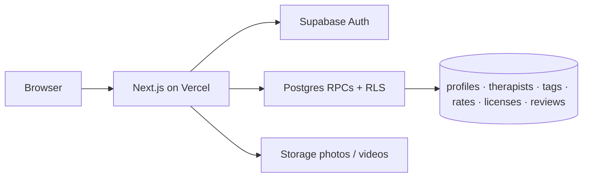

# Kitchen Sink

Patients tap must-have tags. We show therapists who match **some** selected tag. Therapists publish a readable profile (photo, intro video, licenses, rates, cards). No booking.

Repo: [github.com/mkirby42/kitchen_sink](https://github.com/mkirby42/kitchen_sink)
Live: [kitchen-sink-tau.vercel.app](https://kitchen-sink-tau.vercel.app)

Spec: [docs/REQUIREMENTS.md](docs/REQUIREMENTS.md). Prototype shots: [prototype_screenshots/](prototype_screenshots/).

## Quick start

Node 22. Uses the hosted Supabase project. Demo seed therapists are removed by `supabase db query --linked -f supabase/migrations/20260925043000_finish_demo_profile_removal.sql`.

```bash
git clone https://github.com/mkirby42/kitchen_sink.git
cd kitchen_sink
cp .env.example .env.local
# paste NEXT_PUBLIC_SUPABASE_URL + NEXT_PUBLIC_SUPABASE_ANON_KEY (see Reproduce the demo)
npm install
npm run dev
```

Open [http://localhost:3000](http://localhost:3000).

| Route | What |
| --- | --- |
| `/` | Home (Find, Join, **Log in as a therapist**) |
| `/find` | Public search |
| `/t/[id]` | Therapist profile (owner sees **Edit**) |
| `/join` | Therapist onboarding (auth). Returning therapists sign in from home and land on their profile |
| `/admin/media` | Ops helper upload: photo + intro video for an existing therapist (admin) |
| `/admin/reviews` | Ops review queue: approve to publish, or reject and hard-delete (admin) |
| `/robots.txt` | Crawler rules (search + named AI bots allowed; `/admin` disallowed) |
| `/sitemap.xml` | Public URLs: home, find, join, open therapist profiles |
| `/llms.txt` | Plain-language summary for AI tools |

```bash
npm run lint && npm run typecheck && npm test && npm run build
```

## Tech stack

Next.js 16 App Router · TypeScript · Tailwind · `@supabase/ssr` + `@supabase/supabase-js` · hosted Supabase (Auth, Postgres, Storage) · Vercel · GitHub Actions



- `/find` calls one RPC, `search_therapists` — OR overlap on selected tags, ranked by match count, page size 24.
- `/t/[id]` loads one therapist (photo + native `<video>` intro). The owner sees **Edit** (header, top right).
- `/join` is a 4-step therapist wizard; photo required, intro video optional (50MB). Returning therapists sign in from home and land on their profile; **Save changes** calls `update_therapist_profile`.
- `proxy.ts` refreshes the Supabase session. Schema lives in `supabase/migrations/`.

## Run it

### Option A — live app

1. Open [kitchen-sink-tau.vercel.app/find](https://kitchen-sink-tau.vercel.app/find).
2. Results are therapists who joined, are open to new clients, and are listed. Demo seed profiles (`*@kitchensink.demo`) are not part of that list once the removal migration has been applied. Hidden profiles (`therapists.listed = false`) stay in the database and off Find.

### Option B — local app, same hosted data

Create a `.env.local` from the sample below. Keys come from the Supabase project **API** page (anon / publishable key only). No other API keys.

```bash
# .env.local — copy from .env.example
NEXT_PUBLIC_SUPABASE_URL=https://YOUR_PROJECT.supabase.co
NEXT_PUBLIC_SUPABASE_ANON_KEY=eyJhbGciOi...   # anon / publishable, not service_role
```

Then `npm install && npm run dev` and follow Option A on localhost.

Ops helper login, after the admin migration: `ops@example.com` / `seed-only` at `/admin/media`. That account is not a `@kitchensink.demo` seed profile.

### Option C — empty Supabase project

1. Create a project. Enable email Auth. Create public Storage buckets `photos` and `videos`.
2. Apply `supabase/migrations/` in filename order (`supabase db push` against the linked project, or the SQL editor). The last seed-related migration deletes the demo accounts.
3. Put the two public env vars in `.env.local`.
4. `npm run dev`. Join as a therapist to put a real profile in search.

`npm run seed:media` signs in as the removed demo users and will fail after that migration. Do not re-run the historical seed SQL against production.

`SUPABASE_SERVICE_ROLE_KEY` is **not** required for the app, tests, or `seed:media`. Never put the service role in the browser, Vercel public env, or git.

## Data and provenance

Nothing here is a real clinician, patient, license, review, or clinical dataset. No third-party health registry was imported.

| What | Where | Provenance |
| --- | --- | --- |
| Maya Chen (LMFT, CA, rates, cards, 3 reviews) | `supabase/migrations/20260919163316_seed_maya_chen.sql` | Written to match [prototype_screenshots/](prototype_screenshots/). Removed from hosted data by `20260925003000_remove_seed_demo_profiles.sql` when id and `maya@kitchensink.demo` both match. |
| 10 more open therapists + reviews | `supabase/migrations/20260919184500_seed_demo_therapists.sql` | Synthetic profiles. Same removal rule: seed UUID and `*@kitchensink.demo` email. |
| Seed patients J.R., Priya S., D.M. | same Maya seed | Prototype reviewer names. Removed with the same id + email rule. |
| Tag / credential / insurance chips | `lib/tags/presets.ts` + requirements | Prototype + spec labels, not a published taxonomy |
| Headshots + intro clips | `supabase/seed/media/<uuid>/` | Synthetic portraits. The removal migration nulls Storage ownership for matched seed ids. Hosted Storage rejects SQL deletes; remove the objects with the Storage API. |

License numbers, phones, and addresses are fake. Reviews are fiction.

## Known limitations (today)

- No booking, calendars, or in-app messaging. Contact buttons are `mailto:` / `tel:` from listed outreach.
- Reviews are one post per signed-in patient (name or anonymous, three required ratings, optional note). The form warns against personal health information. New reviews stay pending until an admin approves them at `/admin/reviews`. Reject and delete remove the row; nothing archives it. Demo seed reviews are removed with the demo profiles.
- Search is OR overlap (some tags), not AND. Results cap at 24; no pagination UI.
- In-person location is stored; search uses license state, not maps or distance.
- One intro clip per therapist, played as uploaded. No transcoding.
- Associate/trainee credentials are not offered. Education and extra credentials are freeform lists on the profile.
- Patient UI is sign-in and a profile review. No patient onboarding or public patient pages.

These are product gaps, not a freeze. See REQUIREMENTS **Not built yet**.

## Next

- Consult / session booking
- In-app messaging
- License verification and real identity checks
- AND filters, pagination, maps
- Video transcoding
- Custom domain on Vercel (Auth Site URL + redirect allowlist)

## Docs

| File | What |
| --- | --- |
| [docs/REQUIREMENTS.md](docs/REQUIREMENTS.md) | Current product, backlog, schema, matching, CI |
| [AGENTS.md](AGENTS.md) | How agents work in this repo |
| [prototype_screenshots/README.md](prototype_screenshots/README.md) | Screen → screenshot map |

## CI

GitHub Actions on PR and `main`: lint, typecheck, tests, build. Push to `main` deploys production to Vercel after those checks pass. PRs still get Vercel previews.

Repo secrets: `NEXT_PUBLIC_SUPABASE_URL`, `NEXT_PUBLIC_SUPABASE_ANON_KEY`, `VERCEL_DEPLOY_HOOK`. Never put the service role key in CI.
